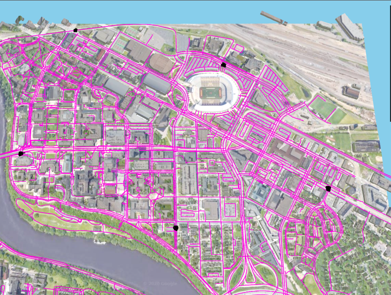
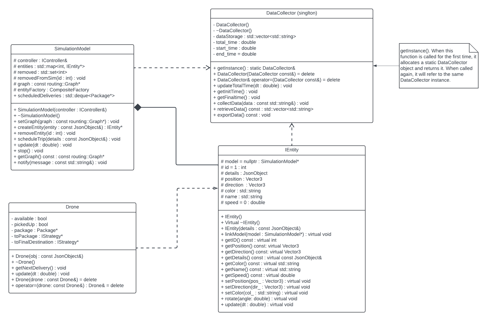
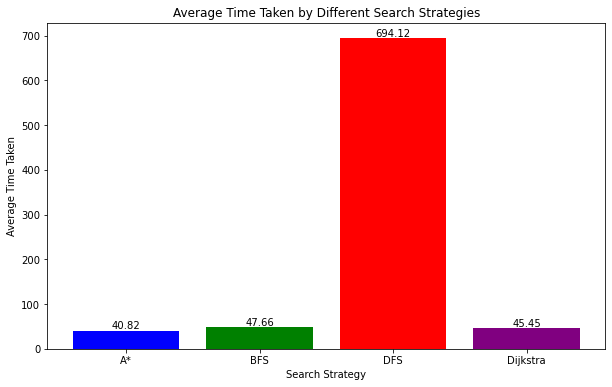

- Mohamed Mourad 

## Important Links
- YouTube Presentation: [Link to Video](https://www.youtube.com/watch?v=rmfun5nBGPQ)
- Docker Container: [Link to Container](https://hub.docker.com/r/mourad2002/final_proj)

## How to Compile
``` make -j ```
### then
``` make run ```

Running "make -j" in the terminal will compile all parts of the program. The "-j" designator will allow your system to compile the program using as many cores that it can spare. This results in a faster compile time.

Running "make run" in the terminal after compiling will run the program and will wait for a connection to be opened in a browser through a port you make available. 

For help with forwarding the port while on an ssh connection, refer to this link:
```https://code.visualstudio.com/docs/remote/ssh```

## Added Feature
### Data Collection and Statistical Integrity
The Last added feature that was implemented. We decided to implement a Data Collector class using the singleton design pattern. We tracked the speed of each drone's delivery using different routing strategies. We ran the drone 30 times for each strategy which are A*, BFS, DFS, and Dijkstra's algorithm for a total of 120 deliveries. We maintained the statistical integrity of our data in two ways. First, as is already mentioned above, we tested each routing strategy 30 times to make sure we had enough data for accurate results. Second, we made sure the drone delivered to the same 5 locations during the trial. This mitigates any variability in the results with regards to the starting location of the drone. The path taken for deliveries can be seen in the image below (the black dots are the locations of the deliveries):



These locations around the east bank UMN campus were chosen because they are somewhat equidistant from each other. In addition, when looking at the purple lines on the map, the areas where the black dots are located are very "busy" intersections. This would make it a little more difficult for the drone to select a certain path to follow. This proved to be true during testing as there were certain scenarios with every routing strategy where it would take a different path than the one it followed before.


## UML Diagram




## Results


From the results, we can see that DFS proved to be the worst. Whenever a delivery was scheduled, and when the drone was using the DFS strategy, it would almost always traverse through the whole simulation before finally reaching its final destination.

As for BFS and Dijkstra's routing strategies, they provided very similar results. BFS would sometimes take a path that was unnecessarily longer than Dijkstra's. Dijkstra's was the second best routing strategy. This is expected because Dijkstra's is pretty much the A* algorithm but without a heuristic function. 

A* (A-star) was shown to be the best routing strategy in terms of average time taken to deliver the package. As stated above, A* is just the Dijkstra's algorithm but with the addition of a heuristic function. The heuristic function provides an optimization when traversing graphs because it selects the most optimal node to explore given the heuristic value of the next nodes it explores. In contrast, Dijkstra's does not have this heuristic function, so it cannot tell which node is necessarily more optimal to visit next within the graph. It is most likely due to these factors why A* performed better than Dijkstra's.

## Final Thoughts
Overall, the addition of a DataCollector to this system proves to be highly beneficial and provides valuable insights. Through its current implementation, it proves beneficial for future developers who decide to implement additional routing strategies. All that would have to be done to measure the efficiency of the newly added routing strategy would be to have the drone make a substantial amount of deliveries and compare the average delivery time to the other strategies. The DataCollector is a central database that keeps track of all deliveries made by the drone. This provides an easy avenue for future developers to analyze data as well as easy integration within the system with there only being one instance of DataCollector at any given time. Another benefit of implementing the DataCollector is that functionality can be added to record more data without changing the current implementation. In conclusion, without having a DataCollector with a centralized database, it would be extremely hard to analyze the efficiency of drone delivery and other optional statistics that can be tested.
